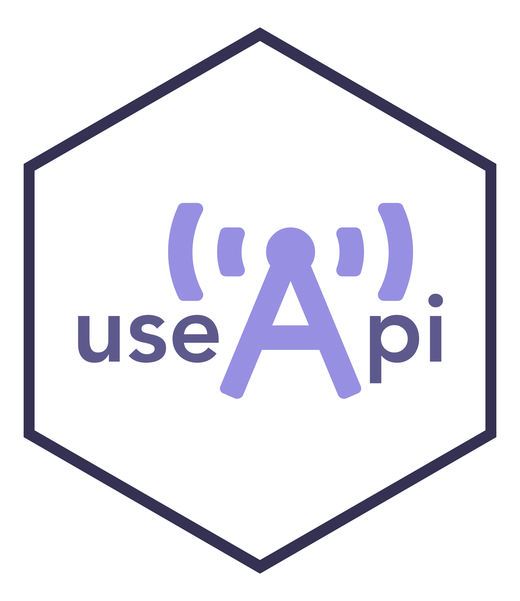

<!-- README.md is generated from README.Rmd. Please edit that file -->

# useapi 

[](https://www.tidyverse.org/lifecycle/#experimental)

📩📨 A workflow for building API wrapper/client packages in R.

## Installation

You can install from [Github](https://github.com/mkearney/useapi) with:

``` r
## install from github
devtools::install_github("mkearney/useapi")
```

## Example

This is a basic example of how to create a new API client package:

``` r
## create example package
create_api_package(path = "/tmp/useapitest", 
  site = "Use API Test",
  base_url = "https://api.useapitest.com/v1")
#> ✔ Changing active project to '/private/tmp/useapitest'
#> ✔ Creating 'R/'
#> ✔ Creating 'man/'
#> ✔ Writing 'DESCRIPTION'
#> ✔ Writing 'NAMESPACE'
#> Writing R/api.R ++++++++++++++++++++++++++++++++++++++++++++++++++++ 100%
#> Writing R/utils.R ++++++++++++++++++++++++++++++++++++++++++++++++++ 100%
#> Writing R/oauth.R ++++++++++++++++++++++++++++++++++++++++++++++++++ 100%
#> ✔ Adding 'httr' to Imports field in DESCRIPTION
#> ● Refer to functions with `httr::fun()`
#> ✔ Adding 'jsonlite' to Imports field in DESCRIPTION
#> ● Refer to functions with `jsonlite::fun()`
#> ✔ Adding 'tibble' to Imports field in DESCRIPTION
#> ● Refer to functions with `tibble::fun()`
#> Updating useapitest documentation
#> Loading useapitest
#> Updating roxygen version in /private/tmp/useapitest/DESCRIPTION
#> Writing NAMESPACE
#> Writing NAMESPACE
#> Writing useapitest_api_get.Rd
#> Writing useapitest_api_post.Rd
#> Writing useapitest_token.Rd
#> Writing useapitest_as_tbl.Rd
#> Installing useapitest
#> '/Library/Frameworks/R.framework/Resources/bin/R' --no-site-file  \
#>   --no-environ --no-save --no-restore --quiet CMD INSTALL  \
#>   '/private/tmp/useapitest'  \
#>   --library='/Library/Frameworks/R.framework/Versions/3.5/Resources/library'  \
#>   --install-tests
#> 
#> Reloading installed useapitest
```

See the [example useapitest package here](example).

``` r
## load new package
library(useapitest)

## create request URL
useapitest:::useapitest_api_call(path = "rstats/apidevtools", 
  n = 20, include_entities = TRUE)
#> [1] "https://api.useapitest.com/v1/rstats/apidevtools?n=20&include_entities=TRUE"
```

It’s all ready to send and receive HTTP requests<sup>1</sup>:

``` r
## send GET request
r <- useapitest_api_get(path = "rstats/apidevtools", n = 20)

## view data
useapitest_as_tbl(r)
```

<sup>1</sup> *Note*: The example is a fictional website/application and
thus will create an error due to an unresolveable host domain.
